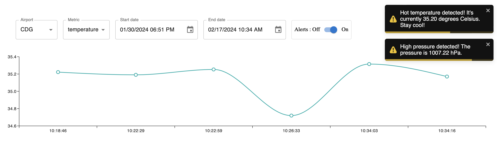

# Airport Weather

As part of our Distributed Systems course at IMT Atlantique Engineering School, this project is about a system that collects, stores and exposes airports weather data coming from sensors.

## Running the project locally

You need to have `Docker` and `Docker Compose` running on your machine (that is to spin up a `MongoDB` database, and a `Mosquitto` server for `MQTT`). Also, you need to have Golang installed on your system.

1. Open a terminal in the project root folder and run:

```sh
docker-compose up --build
```

2. Open a new terminal in the project root folder and run:

```sh
cd ./cmd/sensor && go run sensor.go CDG temperature 23
```

The above command is like saying: I need a temperature sensor on Aéroport de Paris-Charles de Gaulle (CDG being the IATA code of it). `23` is the base temperature (we use it to generate random data based on it).

3. Open another terminal in the project root folder and run:

```sh
cd ./cmd/sensor && go run sensor.go CDG pressure 106
```

4. Open another terminal in the project root folder and run:

```sh
cd ./cmd/file-recorder && go run file-recorder.go
```

This will save the data sent by the sensors in CSV files in the same folder (one per day and per airport)

4. Open another terminal in the project root folder and run:

```sh
cd ./cmd/database-recorder && go run database-recorder.go
```

This will save the data sent by the sensor in the MongoDB database we talked about above.

5. Open another terminal in the project root folder and run:

```sh
cd ./cmd/http-reset-server && go run http-reset-server.go
```

This will expose the stored data through a REST API running on `http://localhost:8080`.

6. Open another terminal in the project root folder and run:

```sh
cd ./cmd/alert-manager && go run alert-manager.go
```

This will send alerts to clients who are subscribed on the topic `airport/codeIata/alert/#` for all metrics related to an airport, or for a specific metric like the temperature with `airport/codeIata/alert/temperature`.
We also built a client app that consumes the REST API. If you want to test it out. Open another terminal in the project root folder and run (you need `node` and `npm` installed on your computer):

```sh
cd ./ihm && npm i && npm run dev
```

You would get the app on `http://localhost:5173/`, something similar to:


